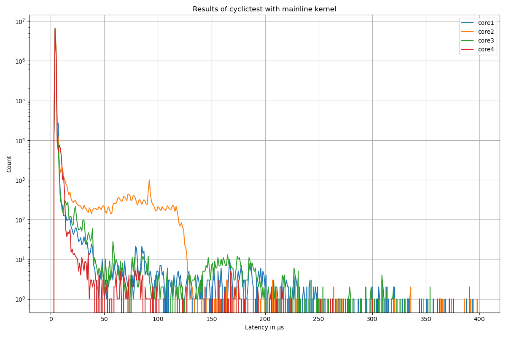
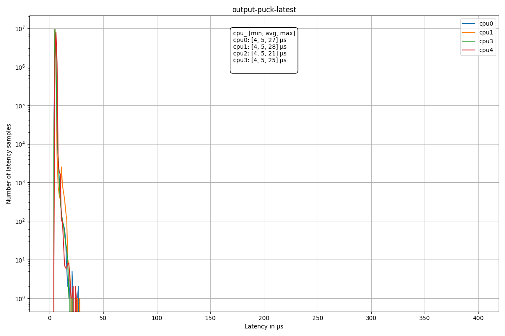

# Plot histogram of the cyclictest output

## Run cyclictest and convert output to csv

```
# Example for machine with 4 cores:
$ sudo cyclictest -l5000000 -m -S -p90 -i200 -h400 -q > output.txt
$ grep -v -e "^#" -e "^$" output.txt | tr " " "," | tr "\t" "," >histogram.csv
$ sed -i '1s/^/time,core1,core2,core3,core4\n /' histogram.csv
```

## Plot the result

```
$ python3 plot-histogram.py <histogram.csv> --title "Plot title"
```

```
usage: plot-histogram.py [-h] [--title TITLE] csv_file

Plot histogram from a CSV file.

positional arguments:
  csv_file       Path to the CSV file

options:
  -h, --help     show this help message and exit
  --title TITLE  Title of the plot
```

## Images

[image1]: ./img/histogram.png " "
[image2]: ./img/histogram-rt.png " "





